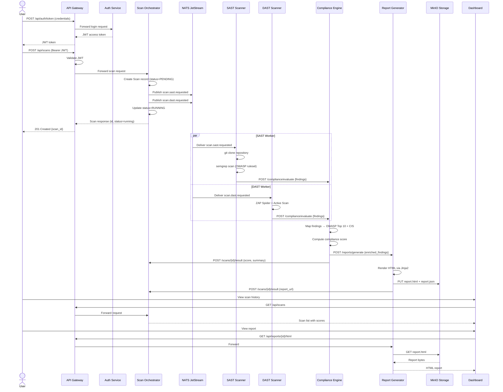

# Scan Lifecycle Data Flow

## Overview

This document describes the end-to-end data flow for a security scan from request submission through to report delivery.

---

## Sequence Diagram



---

## Data Contracts

### Scan Job (NATS payload)
```json
{
  "scan_id": "uuid",
  "project_name": "string",
  "repository_url": "https://...",
  "target_url": "https://..."
}
```

### Finding (normalised – from any scanner)
```json
{
  "rule_id": "string",
  "severity": "CRITICAL|HIGH|MEDIUM|LOW|INFO",
  "message": "string",
  "file": "optional path",
  "url": "optional URL",
  "line_start": 42,
  "cwe": "CWE-89",
  "source": "semgrep|zap",
  "owasp_category": "A03:2021",
  "owasp_name": "Injection",
  "cis_category": "CIS-16"
}
```

### Compliance Evaluation Result
```json
{
  "scan_id": "uuid",
  "compliance_score": 73.5,
  "findings_summary": {
    "total": 14,
    "by_severity": { "CRITICAL": 1, "HIGH": 3, "MEDIUM": 6, "LOW": 4 },
    "by_owasp": { "A03:2021": 5, "A07:2021": 3, "A05:2021": 4, "UNKNOWN": 2 }
  }
}
```
