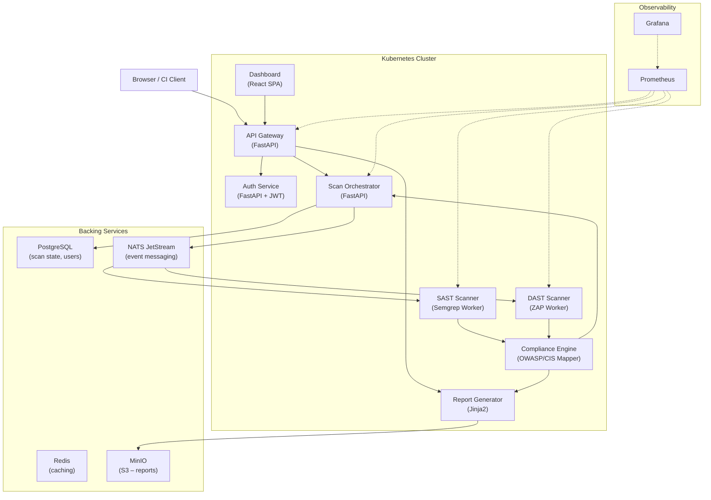

# PSD Cloud Security Platform – System Architecture Overview

## Purpose

PSD Cloud is a cloud-native, multi-tenant security scanning and compliance platform. It performs automated Static Application Security Testing (SAST) and Dynamic Application Security Testing (DAST) against target projects, maps findings to OWASP Top 10 2021 and CIS Controls v8, and produces compliance scores with detailed HTML and JSON reports.

---

## Architectural Style

The system is designed as a **microservices architecture** deployed on **Kubernetes**, following cloud-native principles:

- **Separation of concerns** – each service owns one capability
- **Event-driven processing** – scanners communicate via NATS JetStream (publish-subscribe)
- **Stateless services** – horizontal scaling is native; state lives in PostgreSQL / MinIO
- **Declarative deployment** – Kubernetes manifests for repeatable deployments

---

## High-Level Architecture

---

## Service Responsibilities

| Service | Language | Role |
|---|---|---|
| api-gateway | Python/FastAPI | JWT validation, request routing, CORS |
| auth-service | Python/FastAPI | User registration, login, JWT issuance |
| scan-orchestrator | Python/FastAPI | Scan CRUD, job publishing to NATS, state tracking |
| sast-scanner | Python (Semgrep) | NATS consumer, static analysis runner, result publisher |
| dast-scanner | Python (ZAP API) | NATS consumer, dynamic analysis runner, result publisher |
| compliance-engine | Python/FastAPI | OWASP Top 10 + CIS mapping, compliance score computation |
| report-generator | Python/FastAPI | Jinja2 HTML + JSON reports, MinIO storage |
| dashboard | React (Vite) | Web UI – scan management, compliance scores, reports |

---

## Technology Stack

| Layer | Technology |
|---|---|
| Orchestration | Kubernetes (EKS / AKS / GKE / k3s) |
| API framework | FastAPI (Python 3.12) |
| Frontend | React 18 + Vite |
| Message broker | NATS JetStream |
| Database | PostgreSQL 16 |
| Cache | Redis 7 |
| Object storage | MinIO (S3-compatible) |
| SAST engine | Semgrep |
| DAST engine | OWASP ZAP |
| Observability | Prometheus + Grafana |
| Container registry | GitLab Container Registry |
| CI/CD | GitLab CI |

---

## Deployment Environments

| Environment | How to run |
|---|---|
| Local dev | `docker-compose -f docker-compose.dev.yml up --build` |
| Kubernetes | `kubectl apply -f kubernetes/` |
